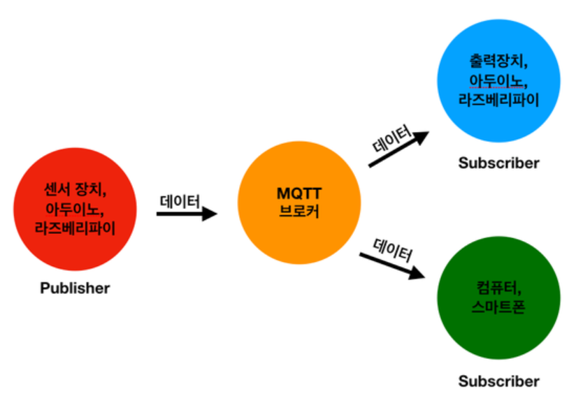
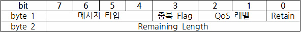

## MQTT (Message Queuing Telemetry Transport)?

-   네트워크 대역폭이 제한되는 원격 위치와의 연결을 위해 설계
-   발행 구독 기반의 메시징 프로토콜
-   Publisher가 데이터를 보내면 Broker가 중재 역할을 하여 Subscriber가 구독하게 만든다.
    

## MQTT Packet Format

-   MQTT 패킷은 2바이트 고정 헤더 + 변수 헤더와 페이로드로 구성됨.
-   헤더는 항상 패킷에 존재하며 나머지 두 개의 변수 헤더와 페이로드가 항상 존재하는 것은 아님.

### MQTT payload

-   MQTT payload max value는 256MB.

### MQTT header

-   MQTT의 헤더는 2Byte이지만 1Byte가 고정 헤더라고 볼 수 있는데, 2Byte의 Remaining Length에는 가변 헤더의 내용들이 들어가기 때문.
-   3 Bit의 중복 Flag는 MQTT의 QoS를 보장하기 위해 메세지를 2번 보낼 수 있는데, 처음 보내는 메세지가 아닌 경우 1(true)로 바뀐다.

### MQTT QoS (Quality of Service)

-   MQTT에서 통신할때 3가지 레벨이 있다.
-   클라이언트 브로커 연결이 된 이후에 Publish할때 동작
-   QoS 0 레벨 : 최대 한번. 한번 만 보내고 보낸 사실은 저장하지 않는다. (UDP와 비슷)
-   QoS 1 레벨(Default) : 최소 한번.
-   QoS 2 레벨 : 정확히 한번.

### 참고 문헌

-   MQTT Standard Packet Structure (http://www.steves-internet-guide.com/mqtt-protocol-messages-overview/)
-   Packet Format 정리 잘되어 있음. (https://openlabpro.com/guide/mqtt-packet-format/)
