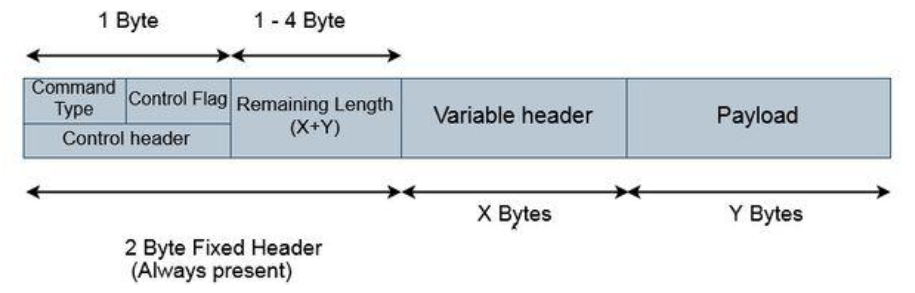

# MQTT (Message Queuing Telemetry Transport)?

-   네트워크 대역폭이 제한되는 원격 위치와의 연결을 위해 설계
-   TCP/IP 프로토콜 위에서 동작(응용 계층에서 동작).
-   TCP/IP 프로토콜 기반.
-   신뢰성 있는 메시징을 위한 QoS 옵션 제공.
-   발행 구독 기반의 메시징 프로토콜
-   Publisher가 데이터를 보내면 Broker가 중재 역할을 하여 Subscriber가 구독하게 만든다.

    

## MQTT QoS (Quality of Service)

-   신뢰성 있는 메시징을 위한 옵션
-   MQTT에서 통신할때 3가지 레벨이 있다.
-   클라이언트 브로커 연결이 된 이후에 Publish할때 동작
-   QoS 0 레벨 : 최대 한번. 한번 만 보내고 보낸 사실은 저장하지 않는다.
-   QoS 1 레벨(Default) : 최소 한번.
-   QoS 2 레벨 : 정확히 한번.

## MQTT Publish steps

1. 클라이언트(이하 디바이스)는 연결 패킷을 전송하여 브로커에 대한 연결 설정.
2. 연결이 완료되었는지 또는 오류가 있는지 확인하기 위해 확인을 기다림.
3. 디바이스는 게시할 항목 이름과 메시지를 포함하는 Publish 패킷을 보냄.
4. QoS(Quality of Service) 수준에 따라 게시 응답 패킷 대기.
5. 통신이 완료된 경우. 클라이언트는 연결 끊기 패킷을 전송하여 브로커와의 연결을 끊을 수 있음.

## MQTT Subscribing steps

1. 연결 패킷을 브로커에 전송.
2. 연결이 완료되었는지 또는 오류가 있는지 확인하기 위해 확인을 기다림.
3. 그리고 연결 승인이 수신되면 적절한 항목 이름과 함께 Subscribe 패킷을 전송.
4. Subscribe 패킷을 기다림.

## MQTT Packet Format

-   MQTT 패킷은 2바이트 고정 헤더 + 변수 헤더와 페이로드로 구성됨.
-   헤더는 항상 패킷에 존재하며 나머지 두 개의 변수 헤더와 페이로드가 항상 존재하는 것은 아님.(고로 MQTT 패킷은 최소 2바이트)

#### MQTT header

-   MQTT의 헤더는 2Byte이지만 1Byte가 고정 헤더라고 볼 수 있는데, 2Byte의 Remaining Length에는 가변 헤더의 내용들이 들어가기 때문.
-   3 Bit의 중복 Flag는 MQTT의 QoS를 보장하기 위해 메세지를 2번 보낼 수 있는데, 처음 보내는 메세지가 아닌 경우 1(true)로 바뀐다.

#### MQTT payload

-   선택 사항 이다.
-   MQTT payload max value는 256MB.

### 참고 문헌

-   MQTT 입문 글 https://dzone.com/refcardz/getting-started-with-mqtt?chapter=1
-   MQTT Standard Packet Structure (http://www.steves-internet-guide.com/mqtt-protocol-messages-overview/)
-   Packet Format 정리 잘되어 있음. (https://openlabpro.com/guide/mqtt-packet-format/)
